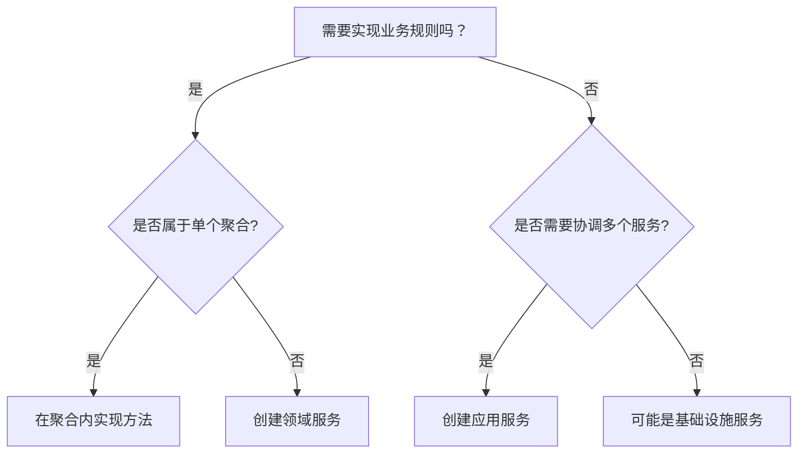

在领域驱动设计（DDD）中，正确划分领域服务（Domain Service）和应用服务（Application Service）是保持架构清晰性的关键。以下是针对贷款系统的具体划分原则和示例：

---

### 一、划分核心原则

| **维度**              | **领域服务**                          | **应用服务**                          |
|-----------------------|-------------------------------------|-------------------------------------|
| **职责定位**           | 实现核心业务规则                      | 协调跨领域操作和技术设施调用            |
| **所属层级**           | 领域层                              | 应用层                              |
| **依赖关系**           | 可依赖其他领域对象和领域服务            | 可调用领域服务和基础设施服务            |
| **典型场景**           | 需要多个聚合协作的业务逻辑              | 事务管理、事件发布、外部服务调用          |
| **方法特征**           | 动词形式命名（如`CalculateInterest`） | 用例流程命名（如`SubmitApplication`） |

---

### 二、贷款系统典型场景划分

#### 场景1：信用评估
```java
// ✅ 领域服务（业务规则集中）
public class CreditEvaluationService {
    public EvaluationResult evaluate(Applicant applicant, LoanDetail detail) {
        // 1. 信用评分计算规则（领域逻辑）
        int score = calculateInternalScore(applicant);
        
        // 2. 结合贷款金额的风险评估（领域逻辑）
        RiskLevel risk = assessRisk(score, detail.amount());
        
        // 3. 返回业务决策结果（领域概念）
        return new EvaluationResult(risk, score > 600);
    }
    
    private int calculateInternalScore(Applicant a) {
        // 基于年龄、收入等计算得分的业务规则
    }
}

// ❌ 错误示例：将信用评分规则放在应用服务（导致贫血模型）
```

#### 场景2：贷款申请提交
```java
// ✅ 应用服务（流程协调）
public class LoanApplicationAppService {
    public void submit(LoanApplicationDTO dto) {
        // 1. 转换DTO -> 领域对象（无业务逻辑）
        LoanApplication application = assembleDomainObject(dto);
        
        // 2. 调用领域服务（业务规则执行）
        EvaluationResult result = creditService.evaluate(
            application.getApplicant(), 
            application.getLoanDetail()
        );
        
        // 3. 更新领域对象状态
        application.acceptEvaluation(result);
        
        // 4. 基础设施操作（持久化+事件发布）
        repository.save(application);
        eventPublisher.publish(new ApplicationSubmittedEvent(application));
    }
}
```

---

### 三、决策树：如何判断服务类型



---

### 四、常见错误案例

#### 错误1：将技术操作放入领域服务
```java
// ❌ 错误：领域服务直接调用数据库
public class LoanCalculatorService {
    // 依赖仓储接口属于基础设施层关注点
    private LoanHistoryRepository repository;  
    
    public BigDecimal calculate(Applicant a) {
        List<Loan> history = repository.findByApplicant(a.getId()); // 基础设施依赖
        // 计算逻辑...
    }
}
```

#### 正确做法：
```java
// ✅ 领域服务仅关注业务计算
public class LoanCalculatorService {
    public BigDecimal calculate(List<Loan> history, Applicant a) {  // 通过参数传入数据
        // 纯业务计算逻辑
    }
}

// ✅ 应用服务协调数据获取
class ApplicationService {
    public void calculate() {
        List<Loan> history = repository.findByApplicant(id);
        BigDecimal result = calculator.calculate(history, applicant);
    }
}
```

---

### 五、典型模式总结

#### 领域服务特征：
1. 实现**跨聚合的业务逻辑**（如不同贷款产品利息计算策略）
2. 封装**外部依赖的业务抽象**（如`CreditEvaluationService`抽象信用评估规则，具体实现可能依赖外部系统）
3. 处理**需要领域知识的算法**（如风险权重计算模型）

#### 应用服务特征：
1. 处理**跨BC（Bounded Context）调用**（如调用支付上下文完成放款）
2. 管理**事务边界**（@Transactional注解）
3. 执行**事件发布**（如发布领域事件到消息队列）
4. 进行**数据组装**（DTO <-> Domain Object转换）

---

### 六、分层调用关系示例
```java
// 接口层（Controller）
@PostMapping("/applications")
public void submit(@RequestBody LoanApplicationDTO dto) {
    // 调用应用服务（用例入口）
    applicationService.submitApplication(dto); 
}

// 应用服务层
public class LoanApplicationAppService {
    public void submitApplication(LoanApplicationDTO dto) {
        // 1. 转换DTO
        LoanApplication app = convertToDomain(dto);
        
        // 2. 调用领域服务（业务规则执行）
        EvaluationResult result = creditService.evaluate(app);
        
        // 3. 修改聚合状态
        app.acceptEvaluation(result);
        
        // 4. 基础设施操作
        repository.save(app);
        smsClient.sendConfirmation(app.getApplicant()); 
    }
}

// 领域服务层
public class CreditEvaluationService {
    // 纯业务逻辑实现
    public EvaluationResult evaluate(LoanApplication app) {
        // 使用领域对象进行业务计算
        int score = app.getApplicant().calculateBaseScore();
        return new EvaluationResult(score > 650);
    }
}
```

---

通过这种划分，可以确保：
1. **领域层**保持技术无关性，聚焦业务本质
2. **应用层**成为连接用户意图与领域模型的纽带
3. 业务规则的修改不会影响技术实现，技术设施更换不会污染业务逻辑