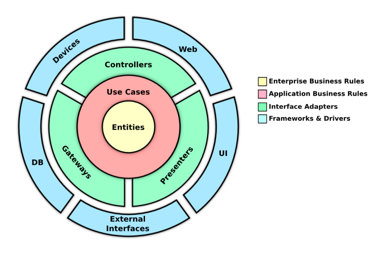

六边形架构（Hexagonal Architecture），又称**端口与适配器架构**（Ports and Adapters Architecture），是一种通过解耦核心业务逻辑与外部依赖（如数据库、用户界面、第三方服务）来实现高内聚、低耦合的软件设计模式。其核心思想是将应用程序的核心逻辑置于架构中心，通过端口和适配器与外部交互，从而提升系统的可测试性、可维护性和可扩展性。

### 核心原则与组件
1. **端口（Ports）**
    - **入站端口**：定义业务逻辑对外暴露的接口（如API或公有方法），接收外部请求（如HTTP请求）。
    - **出站端口**：定义与外部系统交互的规范（如数据库操作接口），由适配器实现具体逻辑。
    - 例如：用户注册接口（入站端口）和数据库存储接口（出站端口）。

2. **适配器（Adapters）**
    - **入站适配器**：将外部请求转换为核心逻辑可处理的格式（如将HTTP请求映射为领域对象）。
    - **出站适配器**：将核心逻辑的输出转换为外部系统所需的格式（如将数据存储到数据库或发送消息队列）。
    - 示例：REST控制器（入站适配器）和JPA数据库实现（出站适配器）。

3. **内外分离**
    - **内部（核心域）**：包含业务规则、领域模型，独立于技术细节（如数据库类型、通信协议）。
    - **外部（适配器层）**：处理与用户界面、数据库、第三方服务的交互。

### 优势与特点
- **高内聚低耦合**：核心逻辑独立于外部依赖，修改适配器不影响业务逻辑。
- **可测试性**：核心逻辑可通过Mock适配器进行单元测试，无需依赖外部环境。
- **灵活扩展**：新增外部系统（如更换数据库）只需添加适配器，无需修改核心代码。
- **技术中立性**：支持多种技术栈（如Java、Go），适配不同业务场景。

### 实际应用场景
- **微服务架构**：每个服务作为独立六边形，通过端口通信。
- **复杂业务系统**：如电商订单处理、银行账户管理，核心逻辑与支付网关、数据库解耦。
- **持续交付**：适配器层简化自动化测试和部署。

### 与其他架构的对比
- **洋葱架构**：强调层次化依赖（依赖指向核心），而六边形架构通过端口对称处理输入/输出。
- **整洁架构**：均遵循依赖倒置原则，但六边形架构更强调端口的双向交互。

### 挑战与建议
- **学习成本**：需深入理解领域驱动设计（DDD）和接口抽象。
- **避免过度设计**：简单场景可能无需严格遵循六边形架构。

示例代码结构（Java）：
```java
// 核心域：用户实体
public class User {
    private UserId id;
    private String email;
    public void updateEmail(String newEmail) { /* 业务规则验证 */ }
}

// 入站端口（接口）
public interface UserService {
    void registerUser(String name, String email);
}

// 出站适配器（数据库实现）
public class JpaUserRepository implements UserRepository {
    public void save(User user) { /* 数据库存储逻辑 */ }
}
```

通过六边形架构，开发者能构建适应业务变化、技术中立的健壮系统。

